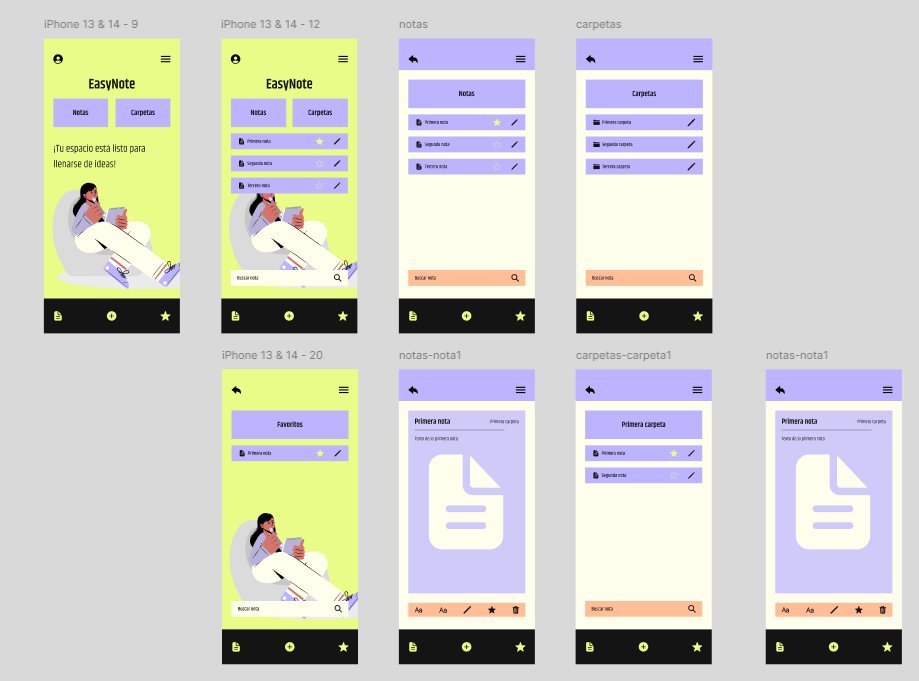
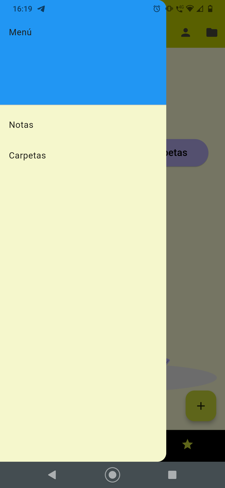
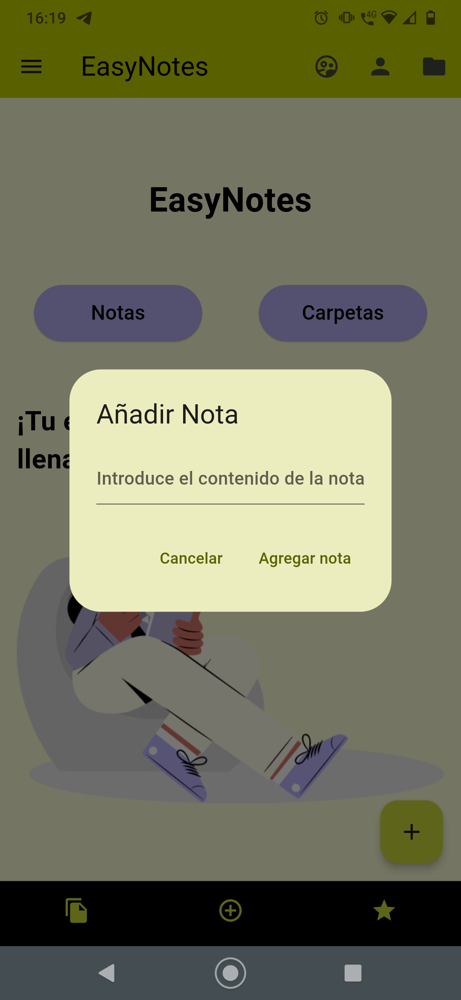
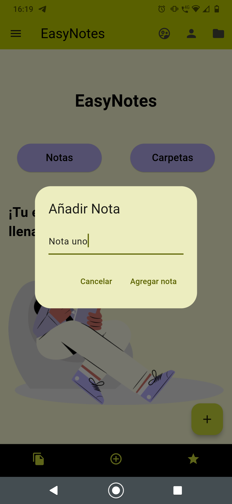
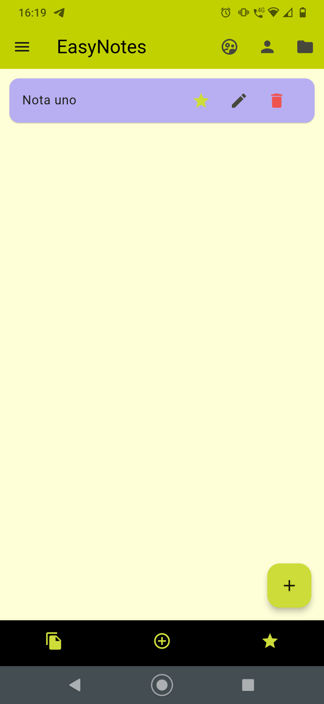
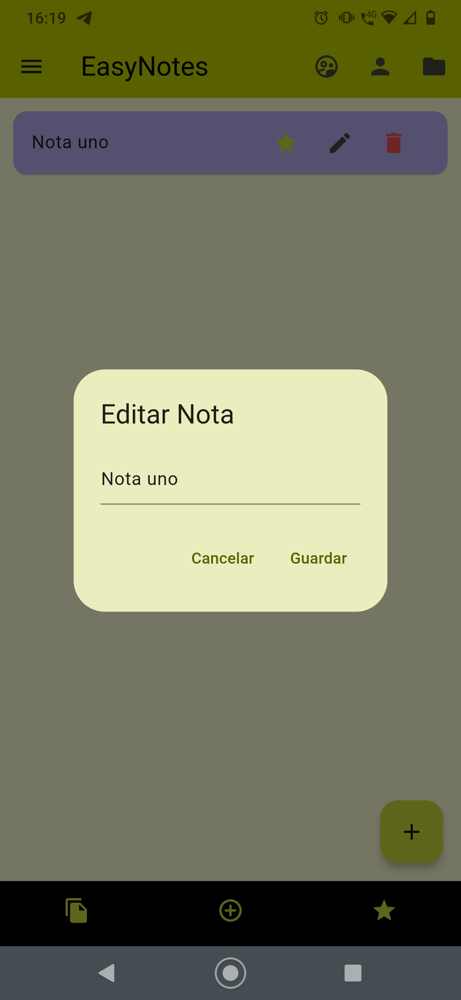
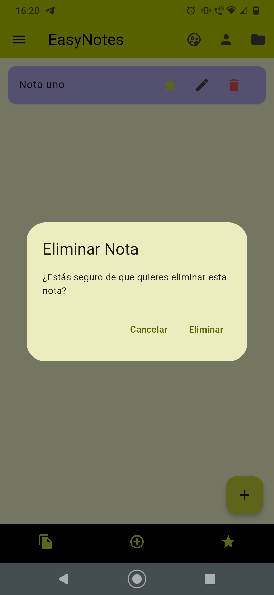
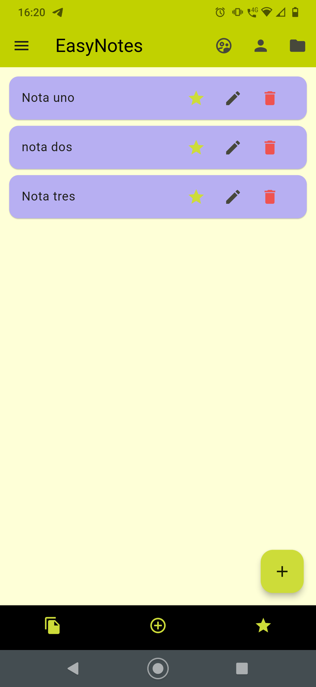

# app_easynote

La aplicaciòn mòvil EasyNote tiene como objetivo ayudar a los usuarios en su vida cotidiana para para creacion de notas en su
dia a dia cuando tienen algo por hacer en su trabajo, en el hogar, eventos sociales, educacion y salud podran organizar sus
actividades atravez de su dispositivo mòvil. Esta aplicacion permitira crear, ver, eliminar, añadir como favorito, actualizar las notas
y carpetas.


# Requerimientos

- Flutter SDK versión 3.16.5
- Dart SDK versión 3.2.3
- Plugins en Android Studio: Dart and Flutter.
- Paquetes: sqflite 2.3.2, provider 6.1.2, path 1.8.3, flutter_screenutil: ^5.9.3
- Android Studio Giraffe 2022.3.1 Patch 3

# Diseño UX en Figma

Se realizo el diseño en Figma de la aplicación móvil seleccionando una paleta de colores y fuente adecuada.



# Flujo de la aplicaciòn mòvil

-Vistas de la aplicación móvil




- Crear, Leer, Actualizar, Eliminar notas y carpetas (CRUD)
  - 1.- Crear nota
    
  - 2.- Escribiendo para crear nota
    
  - 3.- Ver nota uno
    
  - 4.- Editar nota
    
  - 5.- Eliminar nota
    
  - 6.- Listado de notas
    


# Diagrama entidad-relaciòn de la Base de Datos
Aqui se creo el diagrama entidad relacion que nos va a permitir manejar las entidades, atributos para 
la base de datos asi como las relacion de muchos a muchos, etc y poder realizar un back-end en un futuro.

```markdown
+-------------------+
| Note              |
+-------------------+
| id                |
| favorite          |
| creador           |
| content           |
| fechaCreacion     |
| fechaEliminacion  |
+-------------------+
```

```markdown
+---------+
| Folder |
+---------+
| id |
| idNote
| title |
| fechaCreacion |
| fechaEliminacion |
+---------+
```